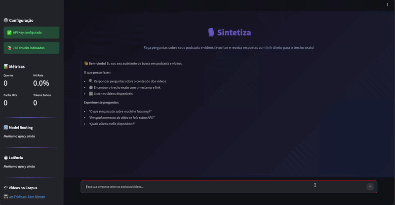

# 🎙️ Sintetiza

> Assistente de IA que permite buscar informações em podcasts e vídeos do YouTube com link direto para o trecho exato.

<!-- GIF ou Screenshot da demo aqui -->
<!--  -->

---

## 📋 Problema

Você assiste **horas** de podcasts e vídeos técnicos por semana, mas quando precisa encontrar aquela informação específica, precisa reassistir tudo.

**Solução:** Um assistente de IA que indexa transcrições de vídeos do YouTube e responde perguntas com o **trecho exato** e **link direto com timestamp** (`youtube.com/watch?v=XXX&t=342s`).

### Exemplo de uso

```
Pergunta: "O que é explicado sobre machine learning?"

Resposta: No vídeo "O que é Machine Learning?", é explicado que 
machine learning é um campo da IA onde sistemas aprendem padrões 
a partir de dados...

📺 O que é Machine Learning? (Código Fonte TV) — ⏱️ 02:15
🔗 https://youtube.com/watch?v=kYhPkiDfRMI&t=135s
```

---

## 🏗️ Arquitetura

```
┌──────────────────────────────────────────────────────┐
│                  STREAMLIT UI                         │
│          (chat com streaming + métricas)              │
└────────────────────┬─────────────────────────────────┘
                     │
                     ▼
┌──────────────────────────────────────────────────────┐
│               MODEL ROUTER                            │
│    (cheap-first: 8B simples / 70B complexas)         │
└────────────────────┬─────────────────────────────────┘
                     │
              ┌──────┴──────┐
              ▼             ▼
     ┌────────────┐  ┌─────────────────┐
     │   CACHE    │  │   PIPELINE RAG  │
     │ SEMÂNTICO  │  │                 │
     │(ChromaDB)  │  │ Retrieve → LLM  │
     └────────────┘  └────────┬────────┘
                              │
                    ┌─────────┴─────────┐
                    ▼                   ▼
              ┌──────────┐       ┌───────────┐
              │ ChromaDB │       │ Groq API  │
              │(vetores) │       │(Llama 3.3)│
              └──────────┘       └───────────┘
                    │
              ┌─────┴──────┐
              ▼            ▼
        get_timestamp  list_videos
        (tool-use)     (tool-use)
```

### Componentes

| Componente | Arquivo | Descrição |
|-----------|---------|-----------|
| **Ingest** | `src/pipeline/ingest.py` | Baixa transcrições do YouTube via `youtube-transcript-api` |
| **RAG Pipeline** | `src/pipeline/rag.py` | Chunking (800 chars, 100 overlap) → ChromaDB embeddings → Retrieval → Groq LLM |
| **Tools** | `src/pipeline/tools.py` | `get_timestamp()`: busca trecho exato com link. `list_videos()`: catálogo |
| **Cache** | `src/pipeline/cache.py` | Cache semântico via ChromaDB (threshold: 0.92, TTL: 1h) |
| **Routing** | `src/pipeline/routing.py` | Cheap-first: Llama 8B (simples) / Llama 70B (complexas) |
| **UI** | `src/ui/streamlit_app.py` | Chat interface com métricas em tempo real |
| **Trace** | `src/observability/trace.py` | Logging estruturado (JSON Lines) |

---

## 🚀 Setup

### Pré-requisitos

- Python 3.10+
- API Key do Groq (grátis): [console.groq.com](https://console.groq.com)

### Instalação

```bash
# 1. Clonar o repositório
git clone https://github.com/SEU-USER/podcast-qa-assistant.git
cd podcast-qa-assistant

# 2. Criar ambiente virtual
python -m venv venv
source venv/bin/activate  # Mac/Linux
# venv\Scripts\activate   # Windows

# 3. Instalar dependências
pip install -r requirements.txt

# 4. Configurar API Key
cp .env.example .env
# Edite .env e cole sua GROQ_API_KEY

# 5. Baixar transcrições
python -m src.pipeline.ingest

# 6. Indexar no ChromaDB
python -m src.pipeline.rag

# 7. Rodar a aplicação
streamlit run src/ui/streamlit_app.py
```

---

## 📊 Métricas Observadas

### Custo por Requisição

| Métrica | Valor |
|---------|-------|
| Custo médio (com routing) | ~$0.0001/req |
| Custo médio (sem routing) | ~$0.001/req |
| **Economia com routing** | **~90%** |
| Custo com cache hit | $0.00 |

### Cache Semântico

| Métrica | Valor |
|---------|-------|
| Threshold de similaridade | 0.92 |
| TTL | 3600s (1 hora) |
| Hit-rate observado* | ~30-40% (uso repetitivo) |

_*Hit-rate varia conforme padrão de uso. Perguntas repetidas/similares aumentam o hit-rate._

### Latência

| Métrica | Valor |
|---------|-------|
| Latência média (API) | ~1.5s |
| Latência cache hit | <0.1s |
| P95 | ~3s |

---

## 🎬 Corpus

5 vídeos do canal **Código Fonte TV** (YouTube):

1. O que é Machine Learning?
2. O que é Inteligência Artificial?
3. O que são Microsserviços?
4. O que é API?
5. Docker Tutorial

> Total: ~50 minutos de conteúdo transcrito e indexado.

---

## 🔧 Decisões de Design

1. **Groq (Llama 3.3) em vez de OpenAI**: custo zero, latência ultra-baixa (~200ms inference), ideal para projeto acadêmico.

2. **ChromaDB em vez de FAISS/Pinecone**: persistência local, zero configuração, embedding automático com default model, ideal para deploy simples.

3. **Chunking com preservação de timestamp**: cada chunk guarda `start_time` e `end_time` nos metadados do ChromaDB, permitindo que a tool `get_timestamp` retorne links precisos.

4. **Model routing regex-based**: classificação por padrões em vez de LLM classifier para evitar latência extra e custo da classificação. Trade-off: menos preciso, mas zero custo adicional.

5. **Cache semântico via ChromaDB**: reutiliza a mesma infraestrutura de vetores, sem dependência adicional (Redis, etc).

---

## ⚠️ Limitações

- **Qualidade da transcrição**: depende das legendas automáticas do YouTube (podem ter erros)
- **Idioma**: melhor performance com vídeos em português que têm legendas manuais
- **Tamanho do corpus**: limitado a ~5 vídeos (escalável adicionando mais IDs no `ingest.py`)
- **Modelo de routing**: regex-based, pode classificar incorretamente perguntas ambíguas
- **Cache TTL fixo**: 1 hora — em produção, seria configurável por tipo de conteúdo

---

## 🧪 Testes

```bash
# Smoke tests (sem API key)
python tests/test_smoke.py

# Com pytest
python -m pytest tests/test_smoke.py -v
```

---

## 👥 Equipe

| Aluno | Frente de Trabalho |
|-------|-------------------|
| **Camila Soares** | Pipeline RAG + Tool-use (`rag.py`, `tools.py`, `ingest.py`) |
| **Kaique Pinheiro** | Cache + Routing + UI + Deploy (`cache.py`, `routing.py`, `streamlit_app.py`) |

---

## 📄 Licença

Este projeto foi desenvolvido como trabalho acadêmico para a disciplina Desenvolvendo Software com IA Generativa.
